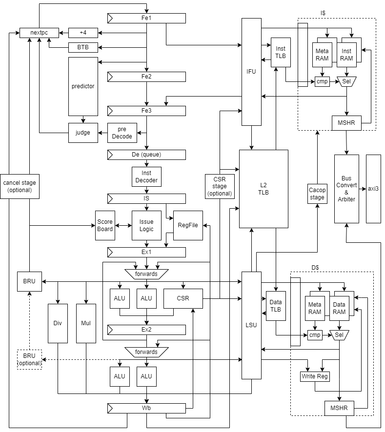

# LA32r_sa

*超标量静态核——卅（sà）~~原意为三十~~*

其他两个核名字起的太好了我又不会起名字于是干脆直接摆烂发挥汉字传统艺能进行一个象形字的用

三竖表示超标量，一横表示顺序流水线

## dependency
* java JDK >= 8
* SBT
## generate Verilog
配置参数位于`src/main/scala/LA32r_sa/Param.scala`

在实例化`AXITop`时可通过参数`useDiff`控制是否生成用于chiplab的difftest输出，`chiplabWrap`目录下是适用于chiplab的Verilog框架，将其与生成的Verilog文件放入chiplab的`IP/myCPU`目录即可。

生成指令位于`src/main/scala/LA32r_sa/AXITop.scala`，生成的Verilog文件位于当前目录下

### 用于FPGA验证
```
sbt "runMain LA32r_sa.GenAXITopFPGA"
```

### 用于chiplab仿真

在此配置下生成的总线宽度为64位，需在`chiplab/chip/config-generator.mak`中设置`AXI64=y`
```
sbt "runMain LA32r_sa.GenAXITopFunc"
```

## microarchitecture
